# Demo-Twincat-Application-CI

> ⚠️ **This repository is not finished yet.**  

- [ ] variants
- [ ] application installer

This demo project shows how to use zkbuild-action to build and test a Twincat PLC in CI on GitHub. It showcases the basic setup, configuration, secrets, and workflow.

## What is happening here

In short: Every push to this repository automatically gives a ready-to-use Windows installer that can install the "MyApplication" PLC on a target system.

And the long story...
This project uses GitHub Actions to automatically build and package the application for you.
GitHub Actions is a feature of GitHub that lets you define "workflows": Scripts that run whenever something happens in the repository (for example, when new code is committed).

In this repository, [the workflow](https://github.com/Zeugwerk/Demo-Twincat-Application-CI/blob/main/.github/workflows/build.yml) is set up so that:

1. Whenever you push a commit to the repository, GitHub automatically starts the workflow in the background.
2. The workflow uses a custom GitHub Action called [zkbuild](https://github.com/Zeugwerk/zkbuild-action).
   - This action knows how to **compile and package** the TwinCAT PLC project in the repository.
   - zkbuild supports multiple TwinCAT versions, including **3.1.4024** and **3.1.4026**.
   - **Project Variants**: TwinCAT projects can define variants (different configurations of the same project, e.g. for different PLC targets or feature sets). The action allows to specify what variant should be build.
   - **Unittests** can be implemented, are automatically executed and published on GitHub. The project variant for testing can optionally differ from the variant, which is used for building. This is useful to setup simulation parameters in the testing variant.
   - **Static code analysis** is executed automatically as well. The result is published on GitHub.
   - After building, it packages everything into an **installer for Windows**.
3. Once the workflow finishes, you can download the installer from the Actions → **Artifacts** section of the GitHub repository.
Running this installer on a Windows machine allows you to install the PLC program onto a PLC target (for example, a Beckhoff PLC or a TwinCAT runtime on Windows).

While the tools utilized by this action can run self-hosted, here this is happening on a build system set-up and hosted by [Zeugwerk](https://www.zeugwerk.at). Because the workflow needs to connect to that external build server to perform the compilation, it must authenticate itself. This is why the workflow requires a username and password – they allow GitHub Actions to log in to the Zeugwerk build system, run the build there, and return the finished Windows installer back to GitHub.

## How CI with zkbuild works on GitHub

```mermaid
sequenceDiagram
    participant U as 🧑‍💻 Developer
    participant GH as 🐙 GitHub Action
    participant R as 📂 GitHub Repo
    participant PS as 📡 Proxy Server
    participant J as 🖧 Jenkins Server
    participant BN as 🖥️ Build Node (VM)

    U->>GH: Trigger workflow (git push)
    GH->>R: Clone source code
    GH->>PS: curl request (auth required)
    PS->>J: Forward build request
    J->>BN: Start zkbuild job
    BN->>R: Clone source code (auth optional)
    BN->>BN: Build with Devtools
    BN->>PS: Upload artifacts
    PS->>GH: Provide artifacts (auth required)
    GH->>U: Deliver artifacts
```

