# Demo-Twincat-Application-CI

work in progress

- [ ] variants
- [x] enable unit tests
- [ ] application installer

This demo project shows how to use zkbuild-action to build and test a Twincat PLC in CI on GitHub. It showcases the basic setup, configuration, secrets, and workflow.

## How CI with zkbuild works on GitHub

```mermaid
sequenceDiagram
    participant U as 🧑‍💻 Developer
    participant GH as 🐙 GitHub Action
    participant R as 📂 GitHub Repo
    participant PS as 📡 Proxy Server
    participant J as 🖧 Jenkins Server
    participant BN as 🖥️ Build Node (VM)

    U->>GH: Trigger workflow
    GH->>R: Clone source code
    GH->>PS: curl request (auth required)
    PS->>J: Forward build request
    J->>BN: Start zkbuild job
    BN->>R: Clone source code (auth optional)
    BN->>BN: Build with Devtools
    BN->>PS: Upload artifacts
    PS->>GH: Provide artifacts (auth required)
    GH->>U: Deliver artifacts
```

